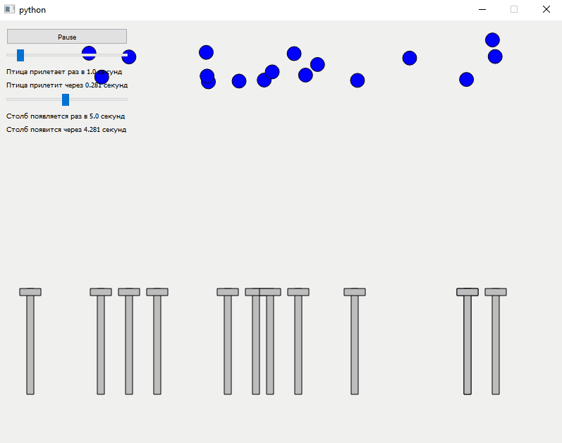

## PyQt 5
# 

# Виртуальное окружение
```bash
python -m venv venv
.\venv\Scripts\activate
```
or
```bash
python3 -m venv venv
source ./venv/bin/activate
```

# Установка зависимостей
```bash
pip install -r requirements.txt
```

# Запуск
```bash
python .\main.py 
```
### options
- -f, --file - file with program initial state
- -c, --create - the name of the file in which the initial state will be saved, default=random_initial_state.json

### example
```bash
python .\main.py -f .\random_initial_state.json 
```
Запустит программу с начальным состоянием указанным в файле random_initial_state.json 

```bash
python .\main.py -с init.json
```
При запуске создаст случайное состояние и сохранит его в файл init.json

# Визуализация 


